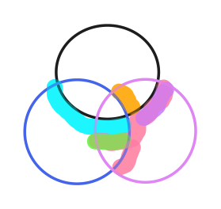

(demo的层的顺序 黑蓝紫)

从下到上一层一层堆叠, 每一层的计算内部, 可以从高到低, 这样就能避免拓展和拓展有重叠的问题

数据结构

维护数据对象需要有两个, 一个记录材料信息:record, 一个只维持最顶层的高度:top

+ `top={高度:[多边形]}`
+ `record=[(多边形,zmax,zmin,材料id)]`

record只增不会减, 是材料的忠实记录, 一条条追加不会改已有的

top会及时更新, top总是完整的仿真区域矩形的不重不漏的划分, 非常类似深度缓冲区, (每个高度内可以merge, 而且是最好merge掉), 高度是有序数组.

以及一个临时的区域: 当次新放的层. 要循环直到其为空, 依次拆分进record和top

涉及的运算

多边形/区域 的扩张, 理论上扩出来的拐角需要是圆
多边形/区域 的 交/并/差

复杂度

所有图层的总多边形数n, 目测是`O(n^3)`次多边形级的运算

伪代码


top需要一边遍历一边在旧的部分插入新的高度

```py
simusetting = {layers,box,lsname,gdsname}
ls=load(.ls.json)
gds=load(.gds)
top=[(0,[box])]
record=[]
while layers:
    current=box & first of layers in ls+gds
    while current.region.noempty:
        for height,region in top.hightolow():
            if (ir = current.region & region).noempty:
                record.push((ir,height+current.thickness,height,current.id))

                irb=ir.bigger(current.expansion) & current.region
                irp=irb-ir
                
                for iheight,iregion in top.hightolow(height):
                    if (er = irp & iregion).noempty:
                        record.push((er,height+current.thickness,iheight,current.id))
                        iregion-=er

                region-=irb
                current.region-=irb
                top.atheight(height+current.thickness)+=irb
```

倾角的实现需要更先进的边界处理工具, 要给每个点绑定额外信息并且跟随多边形运算, 需要自己处理底层
